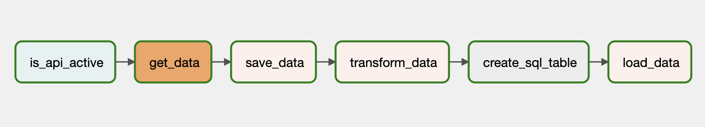

### About The Project
An end-to-end data pipeline was created in this project

* Data Source: Free api provided by the website(`https://weatherstack.com`) was used
* Incoming data in json format is saved and transformed
* Transformed data loaded into PostgreSQL database
*  Api control task, data extract task, data transform task and data load task turned into a pipeline with Airflow

### Built with
* Python
* Airflow

Data Pipeline;

